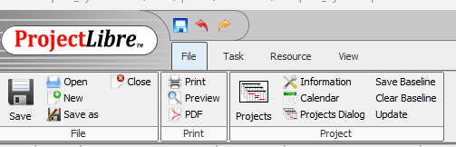
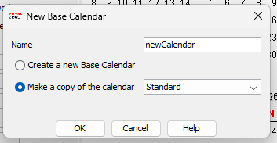
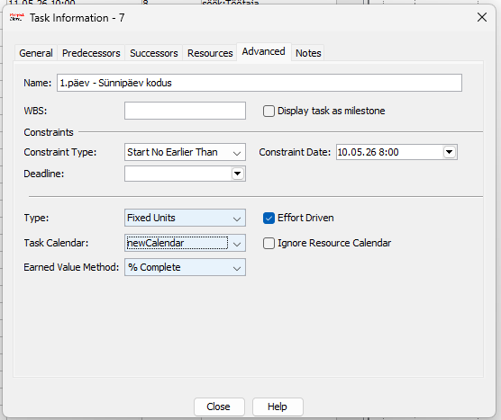
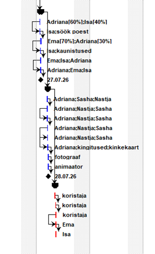
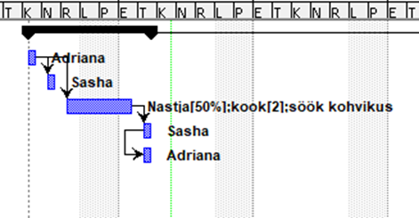

# ProjectLibre Juhend

> Samm-sammuline veebijuhend ProjectLibre kasutamiseks: kalendrite loomine, Gantt diagrammid ja ressursside haldamine.

---

## Sisukord

- [Projekti kirjeldus](#projekti-kirjeldus)
- [Lehed ja failid](#lehed-ja-failid)
- [Failide struktuur](#failide-struktuur)
- [Funktsionaalsused](#funktsionaalsused)
- [Tehtud tööde nimekiri](#tehtud-tööde-nimekiri)
- [Koodinäited](#koodinäited)
- [Pildid](#pildid)
- [Lingid](#lingid)
- [Viited](#viited)

---

## Projekti kirjeldus

See on **ProjectLibre** kasutamise veebijuhend, mis õpetab:

- looma ja seadistama töökalendreid koos eranditega
- koostama Gantt diagramme ja ressursside aruandeid
- navigeerima ProjectLibre liideses ja haldama projekti ülesandeid

> [!NOTE]
> See README kuulub `ProjectLibre` harusse, kus on **ProjectLibre** juhend.
> MS Project juhendi README asub `main` harus.

> [!TIP]
> Veebileht on avalikustatud GitHub Pages kaudu — link on allpool jaotises [Lingid](#lingid).

---

## Lehed ja failid

| Fail | Sisu | Pildid |
|------|------|--------|
| `index.html` | Kalendri loomine ProjectLibre's | img/1.png – img/5.png |
| `diagramm.html` | Gantt diagramm ja ressursside aruanded | img/Pilt1.png – img/Pilt3.png |
| `style.css` | Veebilehe kujundus | — |

---

## Failide struktuur

```
GITHUB-pages/ (ProjectLibre)
├── index.html        # Kalendri loomise juhend
├── diagramm.html     # Diagrammide juhend
├── style.css         # Veebilehe stiil
├── README.md         # See fail
└── img/
    ├── 1.png         # ProjectLibre avakuva
    ├── 2.png         # Tools → Base Calendars menüü
    ├── 3.png         # New Calendar dialoog
    ├── 4.png         # Tööpäevade seadistamine
    ├── 5.png         # Valmis kalender ülesannetega
    ├── Pilt1.png     # Gantt diagramm täisvaates
    ├── Pilt2.png     # Ressursside vaade
    └── Pilt3.png     # Projekti ajajoon
```

---

## Funktsionaalsused

### 1. Kalendri loomine (`index.html`)

1. Ava `Tools → Base Calendars`
2. Vajuta **New**, anna kalendrile nimi (nt `ProjektKalender`)
3. Määra tööpäevad ja tööajad (nt E–R, 08:00–17:00)
4. Salvesta vajutades **OK**

### 2. Diagrammid (`diagramm.html`)

- **Gantt diagramm** — ülesanded ajajoonel, ressursid ribade kõrval
- **Ressursside vaade** — `View → Resource Sheet` kuvab kõik projekti ressursid
- **Aruanded** — `View → Reports` võimaldab vaadata ressursside koormust ja kulusid

---

## Tehtud tööde nimekiri

- [x] `index.html` — kalendri loomise juhend sammudega
- [x] `index.html` — tööaegade seadistamine koos piltidega
- [x] `diagramm.html` — Gantt diagrammi juhend
- [x] `diagramm.html` — ressursside vaate selgitus
- [x] `diagramm.html` — ressursside aruande juhend
- [x] Navigeerimismenüü uuendatud — eemaldatud `valem.html`, lisatud uued lingid
- [x] `valem.html` kustutatud projektist
- [x] Kõik pildid `img/` kaustas
- [x] GitHub Pages avalikustatud `ProjectLibre` branchilt

---

## Koodinäited

### Navigeerimismenüü

```html
<nav>
  <ul>
    <li><a href="index.html">Kalendri loomine</a></li>
    <li><a href="diagramm.html">Diagrammid</a></li>
  </ul>
</nav>
```

### Pildi lisamine

```html

```

### Gantt diagrammi struktuur näide

```
Ülesanne 1  |████████|
Ülesanne 2          |████████████|
Ülesanne 3                   |██████|
            N1    N2    N3    N4    N5
```

---

## Pildid

### Kalendri loomine — Base Calendars



### Kalendri seadistamine



### Gantt diagramm



### Ressursside vaade



---

## Lingid

- [GitHub repositoorium](https://github.com/AdrianaPikaljov/GITHUB-pages)
- [GitHub Pages veebileht](https://adrianapikaljov.github.io/GITHUB-pages/)
- [ProjectLibre ametlik veebileht](https://www.projectlibre.com)
- [GitHub Markdown süntaks](https://docs.github.com/en/get-started/writing-on-github/getting-started-with-writing-and-formatting-on-github/basic-writing-and-formatting-syntax)

---

## Viited

[^1]: ProjectLibre ametlik veebileht: https://www.projectlibre.com
[^2]: GitHub Pages juhend: https://docs.github.com/en/pages
[^3]: ProjectLibre dokumentatsioon: https://sourceforge.net/projects/projectlibre/

---

*© 2026 ProjectLibre juhend — ProjectLibre haru* [^1] [^2] [^3]
