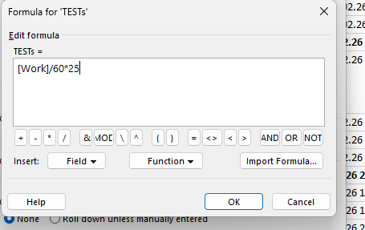
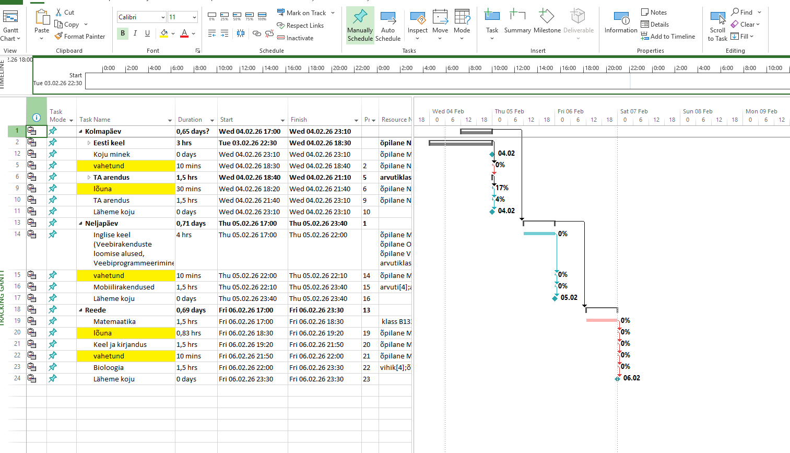

# Microsoft Project juhend

> Samm-sammuline veebijuhend Microsoft Projecti kasutamiseks: kalendrite loomine, kohandatud arvutusväljad ja diagrammide lugemine.

---

## Sisukord

- [Projekti kirjeldus](#projekti-kirjeldus)
- [Lehed ja failid](#lehed-ja-failid)
- [Failide struktuur](#failide-struktuur)
- [Funktsionaalsused](#funktsionaalsused)
- [Tehtud tööde nimekiri](#tehtud-tööde-nimekiri)
- [Koodinäited](#koodinäited)
- [Pildid](#pildid)
- [Lingid](#lingid)
- [Viited](#viited)

---

## Projekti kirjeldus

See on **Microsoft Project** kasutamise veebijuhend, mis õpetab:

- looma ja seadistama töökalendreid koos eranditega
- lisama kohandatud arvutusväljasid valemitega
- lugema Gantti diagramme ja ressursside aruandeid

> [!NOTE]
> See README kuulub `main` harusse, kus on **MS Project** juhend.
> ProjectLibre juhendi README asub `projectLibre` harus.

> [!TIP]
> Veebileht on avalikustatud GitHub Pages kaudu — link on allpool jaotises [Lingid](#lingid).

---

## Lehed ja failid

| Fail | Sisu | Pildid |
|------|------|--------|
| `index.html` | Kalendri loomine MS Projectis | img/1.png – img/5.png |
| `diagramm.html` | Gantti diagramm ja aruanded | img/d1.png – img/d4.png |
| `valem.html` | Kohandatud arvutusvälja lisamine | img/a1.png – img/a4.png |
| `style.css` | Veebilehe kujundus | — |

---

## Failide struktuur

```
GITHUB-pages/ (main)
├── index.html        # Kalendri loomise juhend
├── diagramm.html     # Diagrammide juhend
├── valem.html        # Arvutusvälja juhend
├── style.css         # Veebilehe stiil
├── README.md         # See fail
└── img/
    ├── 1.png         # Project → Change Working Time menüü
    ├── 2.png         # Create New Base Calendar dialoog
    ├── 3.png         # Kalender erandiga KellaAeg
    ├── 4.png         # Erandi KellaAeg detailid (17:00–20:00, 21:00–00:00)
    ├── 5.png         # Gantti diagramm ülesannete ajakavaga
    ├── a1.png        # Custom Fields dialoog
    ├── a2.png        # Rename Field — TESTq
    ├── a3.png        # Formula redaktor: [Work]/60*25
    ├── a4.png        # Custom Fields vahekaart ülesande juures
    ├── d1.png        # Gantti diagramm täisvaates
    ├── d2.png        # Report menüü
    ├── d3.png        # Ressursside kulude aruanne
    └── d4.png        # Projekti ajajoon (Timeline)
```

---

## Funktsionaalsused

### 1. Kalendri loomine (`index.html`)

1. Ava `Project → Change Working Time`
2. Vajuta **Create New Calendar**, anna nimi (nt `TEST`)
3. Lisa erand nimega `KellaAeg` — tööajad 17:00–20:00 ja 21:00–00:00
4. Kordumismuster: **Daily**, kehtib 07.10.2025 – 26.11.2027 (781 korda)

### 2. Kohandatud arvutusväli (`valem.html`)

1. `Project → Custom Fields` → vali `Text1` → **Rename** → `TESTq`
2. Vajuta **Formula…** ja sisesta:
   ```
   [Work]/60*25
   ```
3. Väli ilmub ülesande `Custom Fields` vahekaardil

### 3. Diagrammid (`diagramm.html`)

- **Gantti diagramm** — ülesanded ajajoonel, ressursid ribade kõrval
- **Aruanded** — `Report → Costs → Resource Cost Overview`
- **Ajajoon** — projekti kestus 03.02.26 – 06.02.26

---

## Tehtud tööde nimekiri

- [x] `index.html` — kalendri loomise juhend 4 sammuga
- [x] `index.html` — erandi `KellaAeg` detailid koos piltidega
- [x] `diagramm.html` — Gantti diagrammi juhend
- [x] `diagramm.html` — ressursside kulude aruanne
- [x] `diagramm.html` — projekti ajajoone selgitus
- [x] `valem.html` — kohandatud arvutusvälja juhend
- [x] `valem.html` — valemi `[Work]/60*25` selgitus
- [x] Navigeerimismenüü kõigis failides
- [x] Kõik pildid `img/` kaustas
- [x] GitHub Pages avalikustatud

---

## Koodinäited

### Navigeerimismenüü

```html
<nav>
  <ul>
    <li><a href="index.html">Kalendri loomine</a></li>
    <li><a href="diagramm.html">Diagrammid</a></li>
    <li><a href="valem.html">Arvutusväli</a></li>
  </ul>
</nav>
```

### Pildi lisamine

```html

```

### MS Projecti arvutusvalem

```
[Work]/60*25
```

See valem teisendab tööminutid tundideks ja korrutab tunnitasuga 25.

---

## Pildid

### Kalendri loomine — Change Working Time


### Arvutusvälja valem



### Gantti diagramm



---

## Lingid

- [GitHub repositoorium](https://github.com/AdrianaPikaljov/GITHUB-pages)
- [GitHub Pages veebileht](https://adrianapikaljov.github.io/GITHUB-pages/)
- [Microsoft Project dokumentatsioon](https://support.microsoft.com/en-us/project)
- [GitHub Markdown süntaks](https://docs.github.com/en/get-started/writing-on-github/getting-started-with-writing-and-formatting-on-github/basic-writing-and-formatting-syntax)

---

## Viited

[^1]: Microsoft Project ametlik tugi: https://support.microsoft.com/project
[^2]: GitHub Pages juhend: https://docs.github.com/en/pages
[^3]: Custom Fields MS Projectis: https://support.microsoft.com/en-us/office/create-a-custom-field-in-project

---

*© 2026 Microsoft Project juhend — main haru* [^1] [^2] [^3]
